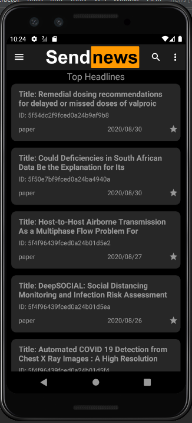
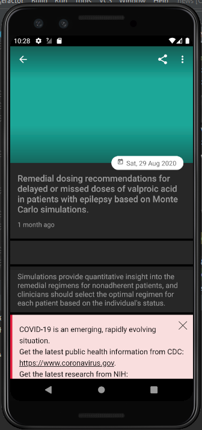
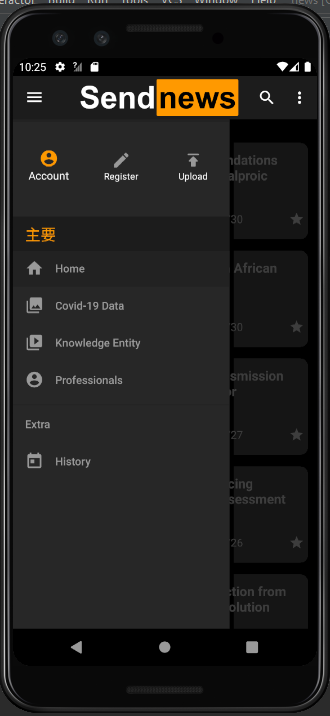
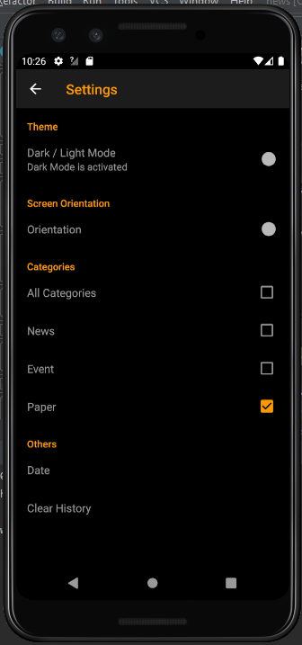

# Sendnews

A Covid-19 News Application completed for my Java Programming Course during our Summer Semester at Tsinghua University.

The data for this news application is provided 

## Application Version
- SDK Version 30

## General Functionality
- show latest news, papers, events
- show information about experts in the field 
- show common diseases 
- show data on the number of infection/deceased/cured based on country

## Other Functionality
- save news to history for offline viewing
- search through news articles 
- sort news articles based on type
- swipe down for refresh, swipe up to load more
- sharing functionality

## Interface Design
| Main News Page | Article Page |
:-------------------------:|:-------------------------:
 | 
|  |  |
| 

## More
Due to time restriction of the project, not all of the functionality was completed. Other functionality that could be implemented. 

1. login/account screen
2. upload own content
3. better ui design